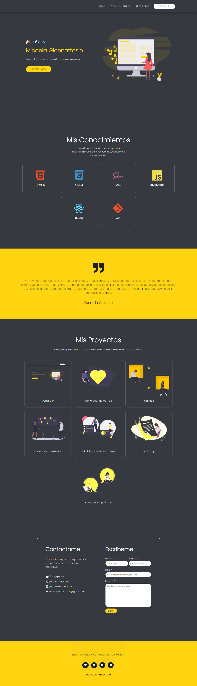

# Portafolio de Micaela Giannattasio 

### Este proyecto está realizado para mostrar un ejemplo de como sería un portafolio para la entrega final del Módulo-01 de Ada.


### Si quieres ver como quedo mi proyecto puedes darle click a este [enlace](https://micagiannattasio.github.io/portfolio/) o puedes hacerlo desde [acá](https://brave-heisenberg-f5eafd.netlify.app).

<br>

***

### Si quieres tener el código en tu computadora, deberás seguir estos pasos en tu terminal.

  - Ir al [repositorio](https://micagiannattasio.github.io/portfolio/)
  - Darle click al botón "forkear"
  - Darle click al botón "code"
  - Copiar la Url
  - Abrir tu terminal y poner el comando de  ```git clone https://micagiannattasio.github.io/portfolio/```
  - Entrar a la carpeta del proyecto y abrirlo en tu IDE

### Este proyecto no necesita la instalación de ninguna dependencia, por ahora!

<br>

***
### Así debería verse el proyecto al final de tu -clone-



<br>

***

### Este portafolio fue desarrollado para las chicas de la cursada 6 de Ada, Agradezco a [Leydy](url) la ayuda proporcionada!

<br>

***

### De Micaela con ❤ para ustedes. 